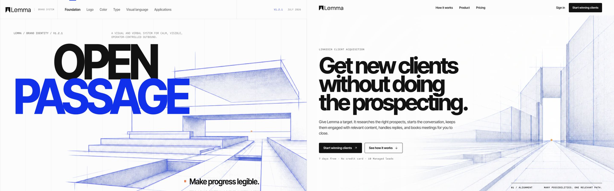
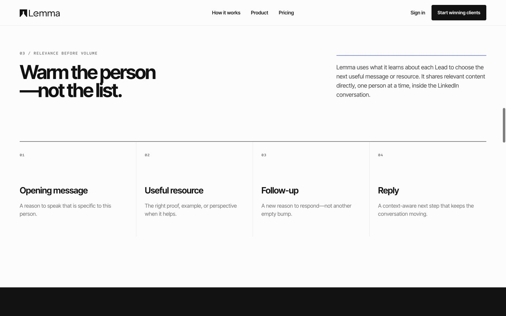
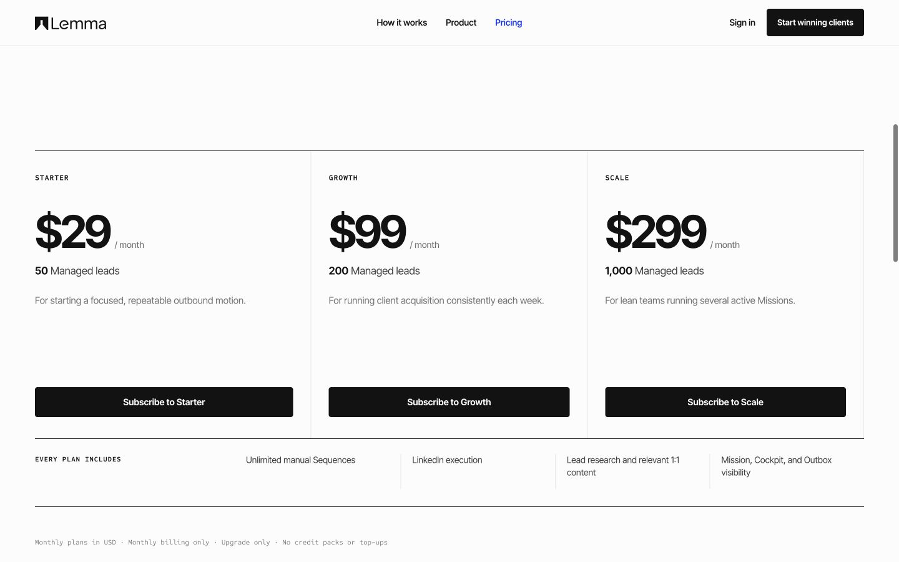
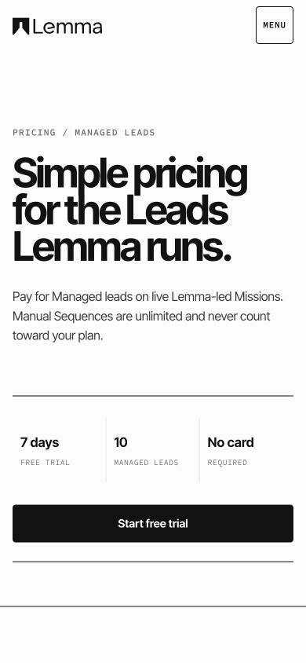
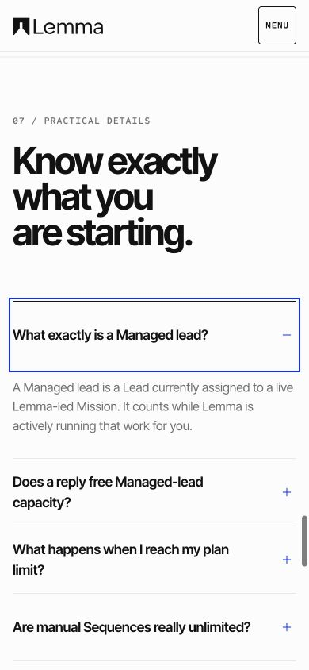

# Lemma landing — Brand Book fidelity audit

Date: 2026-07-23  
Scope: `/` and `/pricing`, shared header, mobile menu, closing CTA, and footer  
Authority: Open Passage Brand Book v1.4.0 and its approved assets  
Product screenshots: intentionally excluded

## Overall verdict

The landing now uses the same visual grammar as the Brand Portal without reproducing its internal-documentation layout. Paper and Ink establish the field, Inter Tight carries the statements, Sometype Mono records structure, Klein Blue indicates direction, and Signal appears only at the human handoff.

No P0 or P1 brand-fidelity finding remains in the audited routes.

## Audited journey

1. **Homepage hero — healthy.** The approved Alignment Court image, protected Paper veil, Open Passage lockup, compact type, and one clear action establish the brand immediately.

   

2. **Problem and mechanism — healthy.** The trade-off is an editorial field note; the dark workflow section remains the main interval sequence.

   

3. **Operator control — healthy.** Ink creates the second dominant moment and Signal is tied to “Needs you / Human judgment,” not decoration.

4. **Founder rationale — healthy.** The section is now a compact field note instead of a second competing monument.

5. **Homepage pricing preview — healthy.** The ruled comparison stays square and neutral. On narrow screens every plan repeats its exact action.

   

6. **Full pricing — healthy.** Desktop uses one shared “Every plan includes” strip to reduce repetition. Mobile preserves complete self-contained plans.

   

7. **Trial decision — healthy.** At 390px and 320px the trial facts and “Start free trial” remain visible in the first screen.

   

8. **FAQ — healthy.** Native details remain keyboard-operable, Lucide Plus/Minus icons mirror state, and the focus ring follows the Brand Book.

   

9. **Closing and footer — healthy.** The approved Horizon Threshold image, Paper-on-Ink logo, restrained veil, and larger link targets preserve clarity on the dark field.

## Corrections made in this pass

- Reserved monumental type for the hero, workflow, operator-control, and closing moments.
- Reduced the supporting section scale and compressed the unsigned founder interlude.
- Replaced Unicode action glyphs with the canonical Lucide family.
- Switched hover actions to Klein Blue Soft and passive indexes to Muted.
- Added a Paper focus ring on Ink, consistent focus treatment for links, 44px footer targets, a skip link, and current-page navigation semantics.
- Moved the mobile pricing decision into the first viewport with a compact ruled trial field.
- Removed repeated desktop plan features in favor of one shared inclusion strip while preserving complete stacked mobile plans.
- Centralized the trial and commercial source/date metadata.
- Replaced pure white veil values with the approved Paper field.

## Responsive and accessibility evidence

- Verified at 1440 × 900, 768 × 1024, 390 × 844, and 320 × 800.
- No horizontal overflow at any audited viewport.
- Reduced-motion behavior remains intact.
- Decorative architecture stays outside the accessibility tree.
- No customer-facing state depends on color alone.
- The mobile menu retains focus containment, Escape close, focus return, and scroll lock.
- Screenshot inspection cannot establish complete WCAG or screen-reader conformance; the audit also used rendered DOM, source semantics, contrast calculations, and production type/build checks.

## Scope limit

The legacy, noindex `/brand` route was not redesigned in this pass. The customer-facing `/` and `/pricing` routes contain no product screenshots or simulated product UI.

final result: passed
